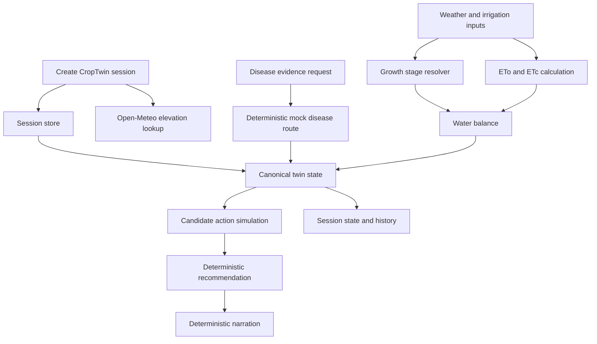

# CropTwin: Tomato Irrigation and Disease Digital Twin

CropTwin is a FastAPI-based tomato digital twin that combines crop stage, weather inputs, soil water balance, disease evidence, irrigation-action simulations, deterministic recommendations, and safe farmer-readable narration.

It is a hackathon MVP for decision support: the system exposes the reasoning behind irrigation guidance, but it is not a production agronomy system and does not replace field inspection or professional advice.

## Hackathon Context

CropTwin was built for the AMD Developer Hackathon Act II on lablab.ai. This repository currently contains the backend MVP: a deterministic API workflow, explicit agronomic assumptions, and automated tests for the main route sequence.

## Problem Statement

Farmers and agronomy teams need irrigation guidance that accounts for crop growth stage, weather, soil-water conditions, and disease risk. Many AI-oriented tools return recommendations without making the physical reasoning easy to inspect. CropTwin demonstrates a tomato digital twin where water-balance calculations, simulations, recommendation rules, and narration boundaries are explicit and testable.

## Solution Overview

CropTwin maintains a session-based digital representation of a tomato crop. A session stores the crop, planting date, location, elevation, soil texture, cached disease evidence, cached growth and water outputs, a canonical current twin state, simulation results, and the latest recommendation.

The workflow is deliberately staged:

1. Create a session with crop, planting date, location, and soil texture.
2. Attach disease evidence through the current deterministic mock disease route.
3. Compute growth stage and water state from weather, crop coefficient, ETo, ETc, soil assumptions, rainfall, and optional irrigation event.
4. Assemble the canonical current twin state from cached disease, growth, and water outputs.
5. Simulate fixed candidate irrigation actions.
6. Build a deterministic irrigation recommendation.
7. Generate deterministic narration that explains the existing recommendation.

## Key Features

- Tomato digital-twin session creation.
- Elevation lookup during session creation through the Open-Meteo elevation API.
- Deterministic tomato growth-stage resolution.
- FAO-style ETo calculation with Penman-Monteith and Hargreaves-Samani fallback.
- Crop coefficient lookup by tomato growth stage.
- Root-zone water-balance calculation with TAW, RAW, depletion, moisture state, and stress band.
- Optional irrigation-event freshness guard to avoid double-counting older events.
- Deterministic mock disease evidence for exercising the full workflow.
- Canonical current-state assembly from cached disease, growth, and water outputs.
- Deterministic simulation of fixed irrigation actions.
- Deterministic recommendation policy with fungal-risk caution handling.
- Deterministic farmer-readable narration by default, without an LLM client.
- Session state and history retrieval.
- Structured API error envelopes.
- End-to-end API workflow tests.

## System Architecture



## Decision and Data Flow

Use the session-scoped API paths in this order:

```text
GET  /health
GET  /system-info

POST /sessions
POST /sessions/{state_id}/predict-disease
POST /sessions/{state_id}/compute-water-state
POST /sessions/{state_id}/update-twin-state
POST /sessions/{state_id}/simulate-actions
POST /sessions/{state_id}/recommend
POST /sessions/{state_id}/narrate

GET  /sessions/{state_id}
GET  /sessions/{state_id}/history
```

Ordering matters. The canonical twin state requires cached disease, growth, and water outputs. Simulation requires the canonical current state. Recommendation requires cached simulation results. Narration requires a cached recommendation.

## Deterministic, AI, and Mocked Components

| Component | Current implementation | Role |
|---|---|---|
| Growth-stage resolution | Deterministic tomato stage resolver | Converts planting date and current date into growth stage and progress |
| ETo and ETc | Deterministic FAO-style calculations | Computes reference and crop evapotranspiration from supplied weather |
| Water balance | Deterministic bucket-style root-zone model | Computes TAW, RAW, depletion, moisture state, and stress band |
| Simulation | Deterministic fixed-action simulator | Projects candidate irrigation actions over a 24-hour horizon |
| Recommendation | Deterministic rule engine | Chooses the irrigation action and constraints from current state plus simulation |
| Disease predictor | Deterministic mock route | Supplies disease evidence, confidence, and uncertainty for the MVP workflow |
| Narration | Deterministic by default; optional client interface exists in narrator module | Explains the accepted recommendation without changing it |

The recommendation engine owns action selection. Disease evidence can add caution, constraints, or inspection advice, but it does not independently override the water-balance and simulation workflow. The narrator explains an existing recommendation and must not recompute or change it.

## AMD/ROCm Integration

AMD/ROCm model training and inference are planned for the real tomato-leaf classifier and are not part of the currently verified backend checkpoint.

The verified backend currently runs CPU-compatible deterministic logic plus a deterministic mock disease predictor. The repository includes `requirements-vision.txt` with `torch`, `torchvision`, and `numpy` placeholders and a note to pin compatible wheels after confirming the AMD container ROCm version. There is no verified ROCm runtime, AMD GPU model artifact, measured GPU metric, Docker deployment, or public deployment in this checkpoint.

## Technology Stack

- Python
- FastAPI
- Pydantic v2
- Uvicorn
- HTTPX
- Pytest
- In-memory state store

Optional or planned vision dependencies are separated in `requirements-vision.txt`. Training utilities currently list `pandas` and `scikit-learn` in `requirements-train.txt`.

## Repository Structure

```text
app/
  main.py                  FastAPI application wiring
  schemas.py               Pydantic request and response schemas
  dependencies.py          Shared store dependency and error handling
  state_store.py           In-memory session and output cache
  routes/                  API route modules
  external/                Elevation API client; weather client placeholder
  growth_stage/            Tomato growth-stage resolver
  water/                   ETo, crop coefficient, and water-balance modules
  disease/                 Placeholder disease package; current API mock lives in routes/disease.py
  simulation/              Candidate irrigation-action simulator
  recommendation/          Deterministic recommendation engine
  narration/               Deterministic narration and optional client protocol

tests/
  test_api_workflow.py     End-to-end API workflow and error-path tests
  test_eto.py              ETo unit tests
  test_eto_openmeteo.py    Frozen Open-Meteo reference cases
  test_growth_stage.py     Growth-stage tests
  test_recommendation.py   Recommendation tests
  test_water_balance.py    Water-balance tests

data/                      Present but currently empty
models/                    Present but currently empty
registration/              Present with placeholder config.py
```

## API Endpoints

| Method | Path | Purpose |
|---|---|---|
| GET | `/health` | Process-level health response |
| GET | `/system-info` | Deterministic MVP assumptions and metadata |
| POST | `/sessions` | Create a tomato digital-twin session |
| GET | `/sessions/{state_id}` | Retrieve canonical current session state |
| GET | `/sessions/{state_id}/history` | Retrieve current-state history |
| POST | `/sessions/{state_id}/predict-disease` | Produce deterministic mock disease evidence |
| POST | `/sessions/{state_id}/compute-water-state` | Compute and cache growth and water outputs |
| POST | `/sessions/{state_id}/update-twin-state` | Assemble canonical current twin state |
| POST | `/sessions/{state_id}/simulate-actions` | Simulate candidate irrigation actions |
| POST | `/sessions/{state_id}/recommend` | Create deterministic irrigation recommendation |
| POST | `/sessions/{state_id}/narrate` | Generate deterministic farmer-readable narration |

## Prerequisites

- Python with virtual environment support. The verified local environment used Python 3.12.7.
- PowerShell commands below assume Windows.
- Internet access is required for session creation when elevation is not supplied, because the API calls Open-Meteo elevation.
- No environment variables are required by the current backend.
- No Dockerfile is present in this checkpoint.
- No model artifact is required for the current deterministic mock disease route.

## Local Installation

```powershell
git clone https://github.com/Eshuredd/AMD_DigitalTwin.git
cd AMD_DigitalTwin

python -m venv .venv
.\.venv\Scripts\Activate.ps1
python -m pip install --upgrade pip
python -m pip install -r requirements.txt
```

Optional vision dependencies are not required for the verified backend workflow:

```powershell
python -m pip install -r requirements-vision.txt
```

Install them only after selecting a PyTorch and torchvision build compatible with the target AMD ROCm environment.

## Environment Configuration

`.env.example` is currently empty, and the inspected application code does not read environment variables. Elevation lookup uses the public Open-Meteo elevation endpoint directly.

## Running the API

```powershell
uvicorn app.main:app --reload
```

Useful local URLs:

- Swagger UI: `http://127.0.0.1:8000/docs`
- OpenAPI JSON: `http://127.0.0.1:8000/openapi.json`
- Health endpoint: `http://127.0.0.1:8000/health`

Do not run `python app/main.py`; the application is intended to be launched by an ASGI server.

## Running Tests

```powershell
python -m pytest -v
python -m pytest -q tests/test_api_workflow.py
```

Verified in this repository checkpoint using `.venv\Scripts\python.exe`:

- `python -m pytest -v`: `33 passed in 0.57s`
- `python -m pytest -q tests/test_api_workflow.py`: `8 passed in 0.51s`

The tests cover the full API workflow, prerequisite failures, state-ID mismatch errors, unknown sessions, irrigation double-count protection, deterministic narration, ETo calculations, and frozen Open-Meteo reference cases.

## Full Demo Workflow

The easiest demo path is Swagger UI:

1. Start the API with `uvicorn app.main:app --reload`.
2. Open `http://127.0.0.1:8000/docs`.
3. Call `POST /sessions`.
4. Copy the returned `state_id`.
5. Call `POST /sessions/{state_id}/predict-disease`.
6. Call `POST /sessions/{state_id}/compute-water-state`.
7. Call `POST /sessions/{state_id}/update-twin-state`.
8. Call `POST /sessions/{state_id}/simulate-actions`.
9. Call `POST /sessions/{state_id}/recommend`.
10. Call `POST /sessions/{state_id}/narrate`.
11. Call `GET /sessions/{state_id}`.
12. Call `GET /sessions/{state_id}/history`.

When a request body contains `state_id`, it must match the `state_id` in the path.

## Example Request Payloads

### Create Session

```json
{
  "crop_type": "tomato",
  "planting_date": "2026-06-01",
  "location": {
    "name": "Hyderabad Test Farm",
    "latitude": 17.385,
    "longitude": 78.4867
  },
  "soil_texture": "sandy_loam"
}
```

If `location.elevation_m` is omitted, the session route fetches elevation from Open-Meteo. To avoid that external call in a local demo, provide a value:

```json
{
  "crop_type": "tomato",
  "planting_date": "2026-06-01",
  "location": {
    "name": "Hyderabad Test Farm",
    "latitude": 17.385,
    "longitude": 78.4867,
    "elevation_m": 542.0
  },
  "soil_texture": "sandy_loam"
}
```

### Predict Disease

The current disease route is a deterministic mock. `image_base64` is treated as an input signal string by the mock; it is not decoded as a real image in this backend checkpoint.

```json
{
  "state_id": "state_xxx",
  "image_base64": "deterministic_tomato_leaf_signal_deterministic_tomato_leaf_signal_deterministic_tomato_leaf_signal_deterministic_tomato_leaf_signal",
  "model_version": "1.0"
}
```

### Compute Water State

```json
{
  "state_id": "state_xxx",
  "current_date": "2026-07-10",
  "weather": {
    "tmin_c": 22.0,
    "tmax_c": 31.0,
    "humidity_pct": 62.0,
    "wind_speed_mps": 2.1,
    "shortwave_radiation_sum_mj_m2": 18.5,
    "rainfall_mm": 0.5,
    "eto_reference_feed": 4.9
  },
  "last_irrigation_event": {
    "timestamp": "2026-07-09T08:00:00Z",
    "amount_mm": 8.0
  }
}
```

`last_irrigation_event` may be `null` or omitted. The route applies the event only when it is newer than the previous canonical current-state update.

### Update Twin State

```json
{
  "state_id": "state_xxx"
}
```

### Simulate Actions

```json
{
  "state_id": "state_xxx",
  "actions": [
    "IRRIGATE_NOW",
    "IRRIGATE_IN_6H",
    "IRRIGATE_TOMORROW_AM",
    "NO_IRRIGATION_24H"
  ]
}
```

### Recommendation and Narration

These routes are bodyless:

```text
POST /sessions/{state_id}/recommend
POST /sessions/{state_id}/narrate
```

## Disease Model Details

Implemented at this checkpoint:

- `POST /sessions/{state_id}/predict-disease` uses deterministic mock logic in `app/routes/disease.py`.
- The mock model name is `mvp_deterministic_tomato_disease_mock`.
- The supported mock model version is `1.0`.
- The mock exists to exercise the end-to-end digital-twin workflow.
- No disease accuracy, field performance, or image-classification metric is claimed.

Not yet implemented:

- Real image decoding and preprocessing.
- Real tomato-leaf disease classifier inference.
- Model artifact loading.
- AMD/ROCm inference path.
- Disease-model evaluation metrics.

The package `app/disease/` is present but its inspected files are currently placeholders.

## Agronomic Assumptions and Constants

These values are MVP defaults, not field-calibrated agronomic recommendations.

| Assumption | Source value |
|---|---|
| Crop support | Tomato only |
| Growth-stage source | `fao56_table11_tomato_apr_may_mediterranean_stage_lengths` |
| Tomato stage durations | initial 30, development 40, mid-season 45, late-season 30 days |
| Kc source | `mvp_fao56_style_tomato_assumed_kc_by_growth_stage` |
| Kc by stage | initial 0.60, development 0.80, mid-season 1.15, late-season 0.80 |
| Soil parameter basis | `mvp_assumed_volumetric_field_capacity_wilting_point_by_soil_texture` |
| Root-depth basis | `mvp_assumed_tomato_root_depth_by_growth_stage` |
| Root depth by stage | initial 0.25 m, development 0.40 m, mid-season 0.70 m, late-season 0.70 m |
| Allowable depletion fraction | 0.50 |
| Fungal confidence threshold | 0.80 |
| Fungal threshold basis | `mvp_assumed_confidence_threshold_for_fungal_wetness_constraint` |
| Narration length safety limit | 1200 characters |
| Narration length basis | `mvp_safety_limit_for_llm_narration_length` |

Soil water defaults are also explicit in `app/water/water_balance.py` for sand, sandy loam, loam, silty loam, clay loam, and clay.

## Safety and Design Boundaries

- The deterministic water model owns crop-water calculations.
- The deterministic recommendation engine owns the irrigation action.
- Disease evidence can add caution, uncertainty, constraints, and inspection advice.
- Disease evidence does not directly choose the irrigation action.
- Narration cannot recompute water balance, rerun simulation, or change the recommendation.
- High-uncertainty disease evidence should be inspected before relying on disease-specific constraints.
- CropTwin does not provide pesticide, fungicide, insecticide, fertilizer, chemical dosage, or disease-treatment advice.
- CropTwin is a prototype decision-support system and does not replace field inspection or professional agronomic guidance.

## Current Limitations

- In-memory state is lost when the process restarts.
- Tomato is the only supported crop.
- Weather values are supplied in API requests; live weather ingestion is not implemented.
- Elevation lookup depends on an external Open-Meteo API unless elevation is supplied in the session request.
- Disease prediction is currently a deterministic mock.
- No authentication or farm/user isolation.
- No persistent database.
- No production monitoring or observability.
- No frontend.
- No Dockerfile or public deployment is present.
- No verified AMD/ROCm model training or inference path is present.

## Future Improvements

- Persistent database-backed sessions.
- Authentication and farm-level isolation.
- Live weather ingestion.
- Field-calibrated crop, soil, and irrigation parameters.
- Real tomato-leaf classifier with explicit artifact metadata.
- AMD/ROCm inference and benchmarked model execution.
- Broader crop support.
- Stronger confidence calibration and disease uncertainty validation.
- Docker deployment.
- Observability, metrics, and operational monitoring.
- Optional constrained LLM narration behind the existing safety checks.
- User-facing web or mobile interface.

## Project Status

The deterministic CropTwin backend MVP is implemented and tested. The current checkpoint verifies the API workflow, deterministic agronomic calculations, simulation, recommendation, narration, and structured error paths. Real tomato-leaf classification, AMD/ROCm model integration, containerization, frontend development, persistent storage, and deployment remain future work.

